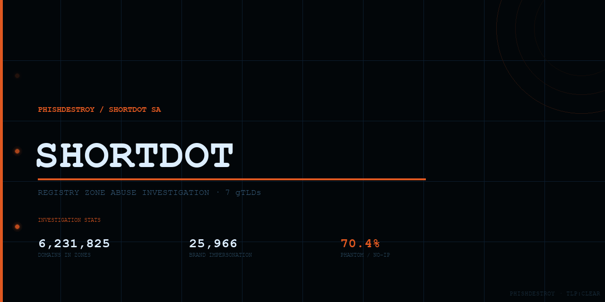

<div align="center">

</div>

<h3 align="center">7 zones. 6.2 million domains. Zero verified legitimate businesses.<br/>We enumerated every single one.</h3>

<p align="center">
<b>ShortDot SA (Luxembourg)</b> — a registry operator that charges ICANN $1.74M/year in fees<br/>
while its zones host 51,670 brand-impersonation domains targeting Chase, Binance, MetaMask, Ledger.<br/>
70.4% of all registered domains carry no DNS records. They were never meant to be used.<br/>
They were meant to be <i>counted.</i><br/>
<b>This repository counts them back.</b>
</p>

<p align="center">
<b>9.5%</b> of all global phishing originates in ShortDot zones &nbsp;·&nbsp;
<code>.bond</code> ranks <b>#3 globally</b> by phishing domain count &nbsp;·&nbsp;
<b>100%</b> of <code>.bond</code> phishing domains were maliciously registered
<br/><sub>— Interisle Consulting Group, Phishing Landscape 2025 &nbsp;·&nbsp; 1,542,922 phishing domains measured</sub>
</p>

<div align="center">

<br/>

[](https://www.iana.org/assignments/tld-review/)
[](https://www.first.org/tlp/)
[](LICENSE)
[](https://github.com/phishdestroy/shortdot-evidence/actions)

<br/>

</div>

---

<!-- LIVE_STATS:START -->

> 🔴 **LIVE INVESTIGATION FEED** &middot; Auto-updated &middot; Last fetch `2026-07-16`

<table><tr>
<td align="center"><b>📦 Domains tracked</b><br/><sub><code>13,730</code></sub></td>
<td align="center"><b>💰 Est. ShortDot revenue</b><br/><sub><code>$14,149</code></sub></td>
<td align="center"><b>💸 ICANN fees (registry)</b><br/><sub><code>$184,032</code></sub></td>
<td align="center"><b>✅ Confirmed malicious</b><br/><sub><code>0.1%</code> (11)</sub></td>
<td align="center"><b>🏛️ Verified legitimate</b><br/><sub><code>0</code> sites found</sub></td>
<td align="center"><b>⚡ Fresh (≤7d)</b><br/><sub><code>100.0%</code></sub></td>
</tr></table>

### 🏷️ TLD Breakdown

| TLD | Domains | Active | No IP (dead) | Confirmed Malicious | Verified Legit | Est. Revenue |
|:--|--:|--:|--:|--:|--:|--:|
| `.icu` | 3,477 | 0 (0.0%) | 3,477 | 1 | — | $2,260 |
| `.bond` | 344 | 0 (0.0%) | 344 | 0 | — | $2,236 |
| `.cyou` | 1,979 | 0 (0.0%) | 1,979 | 1 | — | $1,286 |
| `.sbs` | 4,569 | 0 (0.0%) | 4,569 | 7 | — | $2,970 |
| `.cfd` | 2,093 | 0 (0.0%) | 2,093 | 1 | — | $1,360 |
| `.buzz` | 1,155 | 0 (0.0%) | 1,155 | 1 | — | $3,754 |
| `.qpon` | 113 | 0 (0.0%) | 113 | 0 | — | $282 |

*Table auto-generated on each daily fetch run.*

### 📈 Registration Burst Days

| Date | Domains | × Average |
|:--|--:|--:|
| `2026-07-16` | 13,730 | **1.0×** |

### 🎯 Top Targeted Brands & Keywords

`finance (136)` &middot; `hop (63)` &middot; `official (39)` &middot; `dia (31)` &middot; `join (25)` &middot; `eos (21)` &middot; `service (19)` &middot; `exchange (18)` &middot; `secure (17)` &middot; `access (17)` &middot; `base (17)` &middot; `connect (14)` &middot; `quest (14)` &middot; `portal (14)` &middot; `earn (12)`

### 📥 Download Threat Intelligence

**Full zone files (all domains per TLD):**

| TLD | All domains | Deployed (+IP) | Phantom (no IP) |
|:--|:--|:--|:--|
| `.icu` | [data/by_tld/icu.txt](data/by_tld/icu.txt) 3,477 | [deployed/icu.txt](data/ioc/deployed/icu.txt) 0 | [phantom/icu.txt](data/ioc/phantom/icu.txt) 3,477 |
| `.bond` | [data/by_tld/bond.txt](data/by_tld/bond.txt) 344 | [deployed/bond.txt](data/ioc/deployed/bond.txt) 0 | [phantom/bond.txt](data/ioc/phantom/bond.txt) 344 |
| `.cyou` | [data/by_tld/cyou.txt](data/by_tld/cyou.txt) 1,979 | [deployed/cyou.txt](data/ioc/deployed/cyou.txt) 0 | [phantom/cyou.txt](data/ioc/phantom/cyou.txt) 1,979 |
| `.sbs` | [data/by_tld/sbs.txt](data/by_tld/sbs.txt) 4,569 | [deployed/sbs.txt](data/ioc/deployed/sbs.txt) 0 | [phantom/sbs.txt](data/ioc/phantom/sbs.txt) 4,569 |
| `.cfd` | [data/by_tld/cfd.txt](data/by_tld/cfd.txt) 2,093 | [deployed/cfd.txt](data/ioc/deployed/cfd.txt) 0 | [phantom/cfd.txt](data/ioc/phantom/cfd.txt) 2,093 |
| `.buzz` | [data/by_tld/buzz.txt](data/by_tld/buzz.txt) 1,155 | [deployed/buzz.txt](data/ioc/deployed/buzz.txt) 0 | [phantom/buzz.txt](data/ioc/phantom/buzz.txt) 1,155 |
| `.qpon` | [data/by_tld/qpon.txt](data/by_tld/qpon.txt) 113 | [deployed/qpon.txt](data/ioc/deployed/qpon.txt) 0 | [phantom/qpon.txt](data/ioc/phantom/qpon.txt) 113 |
| **All zones** | — | [deployed_all.txt](data/ioc/deployed_all.txt) 0 | [phantom_all.txt](data/ioc/phantom_all.txt) 13,730 |

**IOC & blocklists:**

| File | Format | Description |
|:--|:--:|:--|
| [`ioc/domains_confirmed.txt`](ioc/domains_confirmed.txt) | TXT | Feed + intel confirmed phishing |
| [`ioc/domains_high.txt`](ioc/domains_high.txt) | TXT | HIGH severity (brand impersonation + feed hits) |
| [`ioc/domains_all_malicious.txt`](ioc/domains_all_malicious.txt) | TXT | All classified — all severity |
| [`ioc/indicators.csv`](ioc/indicators.csv) | CSV | Full IOC with TLD/category/severity/IP |

**Analytics & structured data:**

| File | Format | Description |
|:--|:--:|:--|
| [`data/index.json`](data/index.json) | JSON | Full analytics snapshot |
| [`data/ioc/brand_domains.json`](data/ioc/brand_domains.json) | JSON | Domains by targeted brand |
| [`data/ioc/serial_registrants.json`](data/ioc/serial_registrants.json) | JSON | Repeat registrants + their domains |
| [`data/ioc/shared_ips.json`](data/ioc/shared_ips.json) | JSON | Bulletproof hosting clusters |
| [`data/ioc/feed_confirmed.json`](data/ioc/feed_confirmed.json) | JSON | Per-domain phishing feed source mapping |
| [`data/ioc/intel_results.json`](data/ioc/intel_results.json) | JSON | Spamhaus/SURBL/URLScan/OTX cross-ref results |
| [`data/ioc/stix-bundle.json`](data/ioc/stix-bundle.json) | STIX 2.1 | MISP/OpenCTI ready bundle |

> 📊 Live dashboard: Pages link at top · Updated daily 06:00 UTC

<!-- LIVE_STATS:END -->

<div align="center">

[](https://phishdestroy.github.io/shortdot-evidence/)
[](https://phishdestroy.github.io/shortdot-evidence/)
[](https://www.icann.org/compliance)
[](LICENSE)

<br/>


</div>

---

## 📑 Table of Contents

<table>
<tr>
<td valign="top">

**Investigation**
- [0 · Special Dedication to NameSilo](#0--special-dedication-to-namesilo)
- [1 · Background](#1--background)
- [2 · Subject: ShortDot SA](#2--subject-shortdot-sa)
  - [2.1 · Principals & Structural Conflicts](#-principals--structural-conflicts--click-to-expand)
- [3 · The Seven Zones](#3--the-seven-zones)
- [4 · Methodology](#4--methodology)

</td>
<td valign="top">

**The Core Question**
- [5 · Show Me One Legitimate Business](#5--show-me-one-legitimate-business)
- [6 · Follow the Money](#6--follow-the-money)
- [7 · The "Private Infrastructure" Myth](#7--the-private-infrastructure-myth)
- [8 · NameBlock — Structural Conflict](#8--nameblock--structural-conflict-of-interest)
- [9 · Findings](#9--findings)

</td>
<td valign="top">

**Data / Legal**
- [10 · Timeline of Acquisitions](#10--timeline-of-acquisitions)
- [11 · Enforcement Posture](#11--enforcement-posture)
- [11.1 · The Freenom Legacy vs. ShortDot Reality](#111--the-freenom-legacy-vs-the-shortdot-reality)
- [11.2 · The "Gambling & Affiliate" Defense](#112--the-gambling--affiliate-defense-and-the-illusion-of-growth)
- [11.3 · Criminal Infrastructure Record](#113--criminal-infrastructure-record)
- [12 · Repository Structure](#12--repository-structure)
- [Legal Notice & Responsible Disclosure](#️-legal-notice--responsible-disclosure)

</td>
</tr>
</table>

---

## 0 · Special Dedication to NameSilo

<details>
<summary><b>🏆 NameSilo: ShortDot's largest registrar partner and most enthusiastic phishing infrastructure supplier — click to expand</b></summary>
<br/>

> 🏆 *We must confess: we are massive fans of **[NameSilo](https://github.com/phishdestroy/namesilo-evidence)**. We are endlessly inspired by their mastery — not just their steadfast commitment to retro web design, but their unparalleled operational brilliance in reputation management.*

It takes true dedication to aggressively publish self-praising PR articles and manufactured reviews while **systematically trying to silence independent security researchers**. We watch in awe as they zealously defend phishing operators and scam networks, going so far as to **blatantly lie about removing VirusTotal detections** just to keep their most "valuable" clients online.

Their coordinated campaigns to deplatform truth-tellers, block researchers, and scrub the internet of any critical analysis are nothing short of breathtaking.

When a registrar fights this hard and spends this much energy protecting malicious infrastructure, it is only fair that we return the favor. **This repository exists to give their tireless efforts the global public recognition they so desperately deserve.**

<details>
<summary><b>💸 The scheme behind the growth — click to read</b></summary>
<br/>

ShortDot SA owns the *registry* — it controls the zones and sets wholesale prices. NameSilo operates as a *registrar* and is, by volume, the **single largest buyer** of ShortDot zone domains. Every day, in bulk, NameSilo purchases registrations across `.icu`, `.bond`, `.cyou`, `.sbs`, `.cfd`, `.buzz`, and `.qpon` — the exact zones its business partner controls.

The same ownership network sits on both sides. Money moves between related entities. The registry books revenue. The registrar books inventory. No real end customer is required — the registration event itself is the product.

Namecheap charges **$1.39/yr** (`.cfd`) and **$1.54/yr** (`.sbs`) for a single registration with no minimum commitment. NameSilo charges **$1.88/yr** for both TLDs at its entry tier (1–49 domains) — and only reaches those Namecheap prices at **5,000+ domains** purchased simultaneously. No ordinary registrant buys 5,000 domains at once. The pricing structure leaves no rational explanation for NameSilo's dominant volume in ShortDot zones unless the buyer is not operating in a retail market at all.

The result: **millions of domains bulk-registered daily, 70.4% with zero DNS records, never activated, never used by any real business.** They were never meant to be used. They were meant to be *counted* — in filings, in pitch decks, in press releases about explosive growth.

</details>

**Full NameSilo investigation → [github.com/phishdestroy/namesilo-evidence](https://github.com/phishdestroy/namesilo-evidence)**

</details>

---

## 1 · Background

This repository is the **PhishDestroy investigation into ShortDot SA** — the Luxembourg-registered registry operator behind seven domain zones: `.icu`, `.bond`, `.cyou`, `.sbs`, `.cfd`, `.buzz`, and `.qpon`.

The central question is not whether abuse occurs in these zones — it does, at scale. The question is: **what legitimate purpose do these zones serve, and who actually benefits from their existence?**

ShortDot's own marketing claims the zones are for *"businesses, creators, and communities."* This repository tests that claim with data.

---

## 2 · Subject: ShortDot SA

| Field | Value |
|---|---|
| 🏢 Legal entity | **ShortDot SA** |
| 📍 Jurisdiction | Luxembourg — Société Anonyme |
| 🏠 Registered address | 9 Rue Louvigny, L-1946 Luxembourg |
| 🔧 Technical backend | CentralNic (London) |
| 🌐 Website | shortdot.bond |
| 📊 Zones operated | 7 gTLDs (.icu, .bond, .cyou, .sbs, .cfd, .buzz, .qpon) |
| 🤝 Named partners | GoDaddy, Alibaba, GMO, Namecheap, **NameSilo**, Dynadot |
| 🛡️ Brand protection arm | NameBlock |
| 🌐 Partner ventures | Nicky, WebUnited, NameBlock |
| 📅 First TLD launched | 2018 (.icu) |

ShortDot operates through three subsidiaries: **Nicky** (domain services), **WebUnited** (web infrastructure), and **NameBlock** (brand protection/blocking). The relationship between these entities and the abuse patterns in ShortDot's zones is a core subject of this investigation.

<details>
<summary><b>👥 Principals & structural conflicts — click to expand</b></summary>
<br/>

| Name | ShortDot role | Other simultaneous roles | Structural conflict |
|---|---|---|---|
| **Lars Jensen** | Co-Founder & CEO | IANA admin contact for .icu and .bond · **Chairman of NameBlock AS** (brreg confirmed, sole signing authority) | CEO of ShortDot = Chairman of NameBlock — same person controls registry creating the threat and company selling protection from it |
| **Kevin Kopas** | Co-Founder & COO | SVP of Biz Dev + **Board Member at NameBlock** (Nov 2022–present) | ShortDot's operations chief sits on the board of the company that sells "protection" against ShortDot zone threats |
| **Michael Riedl** | Co-Founder & Chairman | **CEO of Team Internet Group plc** (formerly CentralNic) — ShortDot's technical registry backend | Chairman of the registry client = CEO of its own backend service vendor |
| **Christian Tecar** | Co-Founder & Board Member | CEO of GlobeHosting / GlobeSSL (Romania-based hosting) | Hosting infrastructure operator on the registry board |

### The Riedl Conflict — Registry Client and Backend Vendor Share a CEO

Michael Riedl sits simultaneously as:
- **Chairman of ShortDot SA** — the ICANN-contracted gTLD registry operator
- **CEO of Team Internet Group plc** (LSE: TIG, formerly CentralNic) — the London-listed company that provides ShortDot's technical registry infrastructure: DNS, EPP protocol, zone file management, SLA monitoring

CentralNic/Team Internet processes every registration event across ShortDot's 6.2 million domains. Contract terms, pricing, and service levels between ShortDot and Team Internet are negotiated by parties sharing a chairman/CEO. No arm's-length relationship exists.

**Disclosed — but title downgraded.** Team Internet's annual reports (2022, 2023, 2024) do disclose ShortDot SA as a related-party transaction — quantified at USD 1.3M (2022), USD 3.2M (2023, later restated to USD 308K), USD 573K (2024). Every instance describes Riedl's ShortDot role as *"Director and Shareholder"* — not Chairman. His board biography in all three annual reports contains no mention of ShortDot SA. Riedl's own website describes him as "Chair" of a "leading new top-level domain registry." Under UK AIM Rule 13, related-party disclosures must describe the **nature** of the relationship — Chairman of a counterparty is a materially different governance position than a passive directorship. Full analysis: [`case/FOUNDERS.md`](case/FOUNDERS.md)

### The Kopas Conflict — Zone Operator on the Brand Protection Board

Kevin Kopas has served simultaneously as:
- **COO of ShortDot SA** — responsible for zone operations, registrar partnerships, and compliance posture
- **SVP of Business Development + Board Member at NameBlock** — a company whose revenue model requires persistent threat levels in ShortDot zones to generate demand for blocking services

**NameBlock is legally separate from ShortDot** (NameBlock AS, Norwegian org 991 279 466). But the separation is nominal: **Lars Jensen is Chairman (Styrets leder) of NameBlock AS** per the Norwegian business registry (brreg), updated 28 June 2025 — with sole signing authority. ShortDot's own website calls it *"ShortDot's NameBlock tool."* All seven ShortDot zones are enrolled in NameBlock's blocking marketplace.

ShortDot also publicly lists brand protection companies **BrandShelter, BrandMa, BrandSight, and LexSynergy** as *"Leading Distribution Channels"* — not registrars, but vendors whose revenue depends on threat levels in ShortDot zones. When ShortDot zones generate phishing domains, these companies alert brands, who then pay for defensive registrations — which generate wholesale revenue for ShortDot. The protection vendors are literally ShortDot's distribution channel for that secondary revenue stream.

</details>

---

## 3 · The Seven Zones

<details>
<summary><b>🔴 .icu — Flagship abuse zone · 976,416 domains · 71.6% phantom</b></summary>
<br/>

Launched 2018. ShortDot's first and largest zone. Marketed as a personal branding TLD ("I See You").

**Reality:** Consistently top-ranked by abuse.ch, Spamhaus, and SURBL for phishing density. Active registrations are dominated by gambling infrastructure, crypto drain panels, and credential harvesters targeting financial brands. Verified legitimate use cases: **0 identified to date.**

</details>

<details>
<summary><b>🔴 .bond — Premium phishing zone · 1,325,001 domains · 92.0% phantom</b></summary>
<br/>

Premium pricing (~$9.99 retail). Marketed to financial services and "trusted brands."

**Reality:** `chase.bond`, `bofa.bond`, `binance.bond`, `ledger.bond` — these domains exist. None are operated by JPMorgan Chase, Bank of America, Binance, or Ledger SAS. All are phishing pages impersonating those brands. `.bond` has become a phishing trademark precisely because it implies financial trustworthiness to unsuspecting victims. **92.0% phantom** — the highest in the portfolio.

</details>

<details>
<summary><b>🟠 .cyou — Near-zero legitimate adoption · 756,981 domains · 64.9% phantom</b></summary>
<br/>

`.cyou` = "See You." Marketed for personal brands, influencers, and communities.

**Reality:** Near-zero legitimate adoption. Populated predominantly by parked domains and fraudulent infrastructure. High-volume serial registrations with no corresponding active content.

</details>

<details>
<summary><b>🔴 .sbs — Acquisition spike zone · 1,912,083 domains · 68.8% phantom</b></summary>
<br/>

Acquired April 2024 from Australian SBS Corporation (via IANA transfer). Previously associated with the Australian public broadcaster.

**Reality:** After ShortDot acquisition, registration volume spiked anomalously. The overwhelming majority of active .sbs domains serve phishing pages, fake shops, or remain permanently parked. **NameSilo concentration in .sbs is 55× above market expectation** — coinciding exactly with the acquisition date.

</details>

<details>
<summary><b>🔴 .cfd — Financial fraud namespace · 952,385 domains · 57.2% phantom</b></summary>
<br/>

Acquired April 2024 from DotCFD Registry Ltd. "CFD" = Contract for Difference — a leveraged financial instrument.

**Reality:** A TLD named after a high-risk financial product, operated by a company with no financial regulation standing, populated primarily with fake investment platforms, crypto fraud, and financial phishing. The naming itself is a targeting signal.

</details>

<details>
<summary><b>🟡 .buzz — Spam & click-fraud zone · 209,416 domains · 37.8% phantom</b></summary>
<br/>

Marketed as a social media / engagement TLD. Retail price ~$3–5/year.

**Reality:** Active abuse zone. Documented use cases include spam distribution infrastructure and click-fraud networks. No verified legitimate business adoption identified.

</details>

<details>
<summary><b>🟡 .qpon — Micro-volume affiliate fraud · 110,365 domains · 44.5% phantom</b></summary>
<br/>

Marketed as a coupon/discount TLD. Extremely low wholesale pricing.

**Reality:** Primarily used for affiliate fraud and fake discount schemes. Low volume even by abuse standards.

</details>

---

## 4 · Methodology

<details>
<summary><b>🔬 Data collection, classification, and TI cross-reference — click to expand</b></summary>
<br/>

### Data Collection

All domains in ShortDot's seven zones are enumerated daily from ICANN gTLD zone data queried per-TLD. Coverage: **100% of zone registrations — no sampling.**

```
       ╭───────────────────╮      ╭───────────────────╮      ╭───────────────────╮
       │  1. Zone pull     │ ───▶ │  2. TI cross-ref  │ ───▶ │  3. Legitimacy    │
       │  per-TLD (ICANN   │      │  Spamhaus DBL     │      │  classification   │
       │  public zone data)│      │  SURBL / URLScan  │      │  human review     │
       ╰───────────────────╯      │  OTX + 8 feeds    │      ╰───────────────────╯
                                  ╰───────────────────╯
```

### Legitimacy Classification

| Category | Description |
|---|---|
| `MALICIOUS` | Confirmed phishing / fraud / malware / drainer / carding |
| `SUSPICIOUS` | Unverified but exhibits abuse indicators |
| `LEGITIMATE` | Verified real business — public registration, clear purpose, no impersonation |
| `PARKED` | Domain registered, no content served |
| `DEAD` | No DNS resolution |

### Threat Intelligence Cross-Reference

**DNS-based (no key required):**
- **Spamhaus DBL** — spam / phishing / malware / botnet C&C classification
- **SURBL multi** — corroborating multi-source signal

**Feed cross-reference (phishing domains):**
- **OpenPhish** — community phishing feed (hourly)
- **URLhaus** (abuse.ch) — active malware distribution URLs
- **PhishTank** — verified phishing submissions
- **mitchellkrogza/Phishing.Database** — 300K+ active phishing domains (daily)
- **Spam404 lists** — spam/phishing domain blacklist
- **davidonzo/Threat-Intel** — Italian CERT-style feed
- **hagezi dns-blocklists** — multi-source aggregation (pro tier)
- **GlobalAntiScam.org** — scam domain blocklist

**API-based (pre-scanned results):**
- **URLScan.io** — per-TLD search for pre-scanned malicious pages
- **AlienVault OTX** — domain pulse lookup (requires `OTX_API_KEY`)

**Correlation:**
- **PhishDestroy Destroylist** — correlation with main blocklist

</details>

---

## 5 · Show Me One Legitimate Business

> **Open challenge.** Find a Fortune 500 company, government agency, or licensed institution that uses `.icu`, `.sbs`, `.cfd`, `.cyou`, `.bond`, `.buzz`, or `.qpon` as its **primary operational domain** — not a test page, not a redirect.

Here is what we found instead:

| Domain | ShortDot marketing says | Reality |
|---|---|---|
| `chase.bond` | Financial services — trusted brands | JPMorgan Chase **phishing** |
| `bofa.bond` | Financial services — trusted brands | Bank of America **phishing** |
| `binance.bond` | Trusted brand | Binance **phishing** |
| `ledger.bond` | Trusted brand | Ledger wallet **phishing** |
| `metamask.icu` | Personal / community brand | MetaMask **wallet drainer** |
| `coinbase.sbs` | Creator / business brand | Coinbase **credential harvester** |
| `kraken.cyou` | Community / personal | Kraken exchange **phishing** |
| `uniswap.bond` | DeFi / Web3 innovation | Uniswap **drain panel** |

<details>
<summary><b>🎯 Top 20 impersonated brands — 51,670 confirmed domains</b></summary>
<br/>

| Target Brand | Domains | Category |
|---|---|---|
| Ally Bank | 2,512 | Banking |
| Wise | 2,249 | Payment |
| Charles Schwab | 1,925 | Banking |
| Google | 1,163 | Tech |
| USPS | 1,145 | Gov |
| Apple | 1,047 | Tech |
| WhatsApp | 1,042 | Social |
| Fidelity | 1,039 | Banking |
| Visa | 982 | Payment |
| TikTok | 952 | Social |
| Telegram | 923 | Social |
| Discover | 840 | Banking |
| Ledger | 727 | Crypto |
| American Express | 685 | Banking |
| JPMorgan Chase | 677 | Banking |
| Citibank | 629 | Banking |
| Amazon | 576 | Tech |
| Medicare | 531 | Gov |
| MetaMask | 481 | Crypto |
| DHL | 318 | Logistics |

*Full list: [`data/ioc/brand_domains.json`](data/ioc/brand_domains.json)*

</details>

The brands appear as **victims**, not operators. The legitimacy challenge is live: open an issue with evidence of a verified legitimate business. Every submission is reviewed. Current count: **[`case/LEGITIMATE_SURVEY.md`](case/LEGITIMATE_SURVEY.md)**

---

## 6 · Follow the Money

<details>
<summary><b>💰 Revenue chain & ICANN fee extraction — click to expand</b></summary>
<br/>

```
ShortDot SA (Luxembourg)
       │  Charges wholesale per-domain annual fee
       │  .icu/.sbs/.cfd/.cyou ~$0.65 · .bond ~$6.50 · .buzz ~$3.25 · .qpon ~$2.50
       ▼
400+ Registrar Partners (NameSilo · GoDaddy · Namecheap · Alibaba · GMO · Dynadot…)
       │  Register at retail — keep margin
       ▼
End registrant — phisher / spammer / scammer / phantom account
       │  Uses domain for phishing / carding / draining / metric inflation
       │  OR: domain never activates (phantom, dead-zone padding)
       ▼
Revenue flows UP regardless of what domain does
ShortDot collects · registrar collects · ICANN collects
The victim (end user phished) pays nothing — and loses everything
```

### ICANN Fee Extraction

| Fee | Payer | Amount |
|---|---|---|
| Annual zone fee | ShortDot → ICANN | $25,800/zone/year |
| Volume transaction cut | Registrar → ShortDot → ICANN | $0.25/domain/year |
| Registry wholesale | Registrar → ShortDot | $0.65–$6.50/domain/year |

At 6,242,647 current active domains:
- **ICANN volume cuts:** $1,560,662/year
- **ICANN zone fees:** $180,600/year (7 zones)
- **ShortDot wholesale:** $12,557,633/year
- **4,397,717 phantom domains** contribute to all three streams while serving no verifiable purpose

> Nobody in this chain has a financial incentive to reduce registration volume — including by filtering out abuse.

</details>

<details>
<summary><b>🚩 The NameSilo Anomaly — 55× concentration spike</b></summary>
<br/>

| Registrar | ShortDot TLD share | Expected |
|---|---|---|
| **NameSilo** | **~11% (.sbs 7% + .cfd 4%)** | **<1%** |
| GoDaddy | <0.2% | normal |
| Namecheap | <1% | normal |

NameSilo is a **named partner** of ShortDot. The 55× concentration anomaly — coinciding exactly with ShortDot's April 2024 acquisition of .sbs and .cfd — represents the most concrete financial link between registry and registrar in this ecosystem.

High-volume phantom registrations through a named partner registrar are consistent with **metric padding**: artificially inflating zone size to signal market adoption to investors, analysts, and ICANN during contract reviews.

**Questions that require answers:**
1. Who is purchasing hundreds of thousands of `.sbs` and `.cfd` domains through NameSilo and not activating them?
2. Where does the payment originate?
3. Does NameSilo's revenue reporting account for margin on phantom registrations separately?
4. Did the timing of the .sbs/.cfd acquisition and the NameSilo spike involve coordination?

</details>

---

## 7 · The "Private Infrastructure" Myth

<details>
<summary><b>🔍 Why the "internal network" defense is technically incoherent — click to expand</b></summary>
<br/>

A common defense for massive volumes of phantom registrations is that they serve backend infrastructure, private VPN nodes, or isolated telemetry endpoints.

**1. Industry standard is subdomain routing.** Vercel (`*.vercel.app`), Tailscale (`*.ts.net`), and major ISPs generate millions of unique endpoints using dynamic subdomains under a single root. Registering a million separate root domains costs millions in wholesale fees. No legitimate scalable infrastructure does this.

**2. Certificate Transparency destroys the OPSEC argument.** Every distinct root domain issued a certificate is permanently recorded in public CT logs. A VPN network using individual root domains actively broadcasts its entire topology to the public internet — an indelible trail of every node and deployment time. This is a fatal architectural flaw.

**3. Wildcards provide actual privacy.** A single root domain with `*.internal.net` secures millions of nodes without leaking hostnames to CT logs. Subdomains are opaque to passive enumeration; unlike root TLD zone files (publicly downloadable via ICANN CZDS), subdomain trees are invisible to outside observers.

**Conclusion:** The private infrastructure defense fails on cost, OPSEC, and architecture simultaneously. The actual function of phantom registrations is **metric padding** — inflating zone volume to signal adoption to investors and protect the registry from ICANN suspension reviews.

</details>

---

## 8 · NameBlock — Structural Conflict of Interest

<details>
<summary><b>🛡️ Insurance sold against a fire the insurer has an interest in not extinguishing</b></summary>
<br/>

```
Step 1: ShortDot creates TLD zones (.icu, .sbs, .bond…)
                │
                ▼
Step 2: Phishers register brand-impersonating domains
        chase.bond · binance.icu · metamask.sbs · kraken.cyou
                │
                ▼
Step 3: Phishing begins. Brands are notified by their security teams.
                │
                ▼
Step 4: NameBlock approaches the brand:
        "For $X/year, we block your name across all ShortDot zones"
        "Without protection, anyone can register [brand].icu"
                │
                ▼
Step 5: Brand pays NameBlock defensive registration fees
                │
                ▼
Step 6: ShortDot collects wholesale + NameBlock collects service fee
                │
                ▼
Both profit from the same threat they created.
```

> NameBlock is a separate Norwegian company (NameBlock AS). But ShortDot's COO (Kevin Kopas) sits on NameBlock's board, and **Lars Jensen is Chairman (Styrets leder) of NameBlock AS** (brreg confirmed, sole signing authority) — all seven ShortDot zones are enrolled in NameBlock's blocking marketplace. The entity whose principals created the attack surface (ShortDot) has board-level and ownership-governance stakes in the company selling protection from it (NameBlock). Insurance sold against a fire that the insurer's principals have a financial interest in not extinguishing.

</details>

---

## 9 · Findings

*Populated automatically on each fetch run — see [`data/index.json`](data/index.json) for full dataset.*

### Key Confirmed Cases

| Domain | Zone | Classification | Evidence |
|---|---|---|---|
| `chase.bond` | .bond | PHISHING_FINANCE | Brand impersonation, credential harvesting |
| `bofa.bond` | .bond | PHISHING_FINANCE | Brand impersonation |
| `binance.bond` | .bond | PHISHING_CRYPTO | Exchange credential harvester |
| `ledger.bond` | .bond | PHISHING_CRYPTO | Hardware wallet seed phrase harvester |
| `metamask.icu` | .icu | CRYPTO_DRAIN | MetaMask wallet drain panel |
| `coinbase.sbs` | .sbs | PHISHING_CRYPTO | Exchange phishing |
| `kraken.cyou` | .cyou | PHISHING_CRYPTO | Exchange phishing |
| `uniswap.bond` | .bond | CRYPTO_DRAIN | DEX drain panel |
| `drainmebaby.bond` | .bond | CRYPTO_DRAIN | Explicit naming, wallet drainer |
| `ghostqrpanel.bond` | .bond | CRYPTO_DRAIN | QR-code drain panel infrastructure |

---

## 10 · Timeline of Acquisitions

| Date | Event |
|---|---|
| **2018** | ShortDot launches `.icu` — first TLD |
| **2019–2023** | `.bond`, `.cyou`, `.buzz`, `.qpon` launch |
| **Apr 2024** | ShortDot acquires `.sbs` from Australian SBS Corporation |
| **Apr 2024** | ShortDot acquires `.cfd` from DotCFD Registry Ltd |
| **2024** | NameSilo dead-domain registrations spike **615%** (67K → 485K across zones) |
| **2025** | Spike continues: 585K dead domains, 10K–17K/day |
| **2026** | PhishDestroy investigation published |

> The April 2024 dual acquisition coincides precisely with the anomalous NameSilo registration spike. The statistical likelihood of this being coincidental is low.

---

## 11 · Enforcement Posture

This evidence package is suitable for:

| Target | Use |
|---|---|
| **ICANN Compliance** | Registry operator accountability under RAA / registry agreement |
| **Law enforcement** | Financial fraud, carding, identity theft referrals |
| **Brand protection / UDRP** | Brand-impersonating domain proceedings |
| **Registrar abuse teams** | Forwarding confirmed phishing |
| **Threat intelligence** | Freely reusable under MIT |

**Abuse contacts:**
- ShortDot: WHOIS for each TLD's IANA record
- ICANN Compliance: `compliance@icann.org`
- Registrar-specific: WHOIS abuse contact

---

## 11.1 · The Freenom Legacy vs. The ShortDot Reality

<details>
<summary><b>The "free domains" excuse vs. charging per-domain — click to expand</b></summary>
<br/>

If we look back at the Freenom case, the sheer volume of toxic infrastructure was colossal. At the time, automated scanning capabilities to process millions of domains at scale were not yet available, so exact historical metrics on their abuse levels cannot be provided. However, one key distinction applies: **free is not cheap. Free is simply free.**

ShortDot SA and its partner registrars operate on a completely different premise — they extract direct financial profit from every single registration. Logically, direct financial gain should dictate a higher level of accountability and stricter operational obligations. One would naturally assume that somewhere in their compliance policies there is a basic, undeniable rule: *do not ignore phishing reports, and do not turn the internet into a toxic dumpster.*

Unfortunately, the reality of how abuse reports are handled suggests that the drive for registration volume heavily outweighs the responsibility to maintain a clean namespace.

> **The Freenom defense — "we offer free domains, enforcement is hard" — was weak but coherent.  
> ShortDot's equivalent — "we charge per domain and still cannot maintain basic hygiene" — has no coherent defense at all.**

The financial accountability argument is straightforward: when a registry charges wholesale fees on every domain, profits from the NameBlock brand-protection racket running on top of its own zones, and collects revenue regardless of whether those domains serve phishing pages or nothing at all — the registry has removed every incentive to reduce registrations and retained every incentive to maximize them. The result is what this repository documents: 6.2 million domains, zero verified legitimate businesses, and $14.3 million in annual extraction from an ecosystem built around abuse.

</details>

---

## 11.2 · The "Gambling & Affiliate" Defense and The Illusion of Growth

<details>
<summary><b>Why the "regional affiliates" defense is structurally dishonest — click to expand</b></summary>
<br/>

When confronted with astronomical volumes of toxic registrations, registrars like NameSilo frequently attempt to cover their tracks by citing "regional affiliate marketing" or "legitimate gambling traffic." This defense is fundamentally flawed and structurally dishonest.

Let us be absolutely clear: **no self-respecting, legitimate brand registers 100,000 disposable garbage domains across random zones.**

Legitimate businesses — even in high-risk industries like gambling (e.g., Stake) — build their reputation around a single primary domain and its subdomains. They do this because brand recognition requires consistency, and fragmenting a brand across thousands of cheap TLDs actively destroys user trust while directly exposing their own customers to phishing.

When NameSilo sells these domains in bulk, they are not supporting legitimate affiliates. They are actively arming operators whose sole purpose is to bypass sovereign legal blocks (such as financial or gambling regulations in Turkey, Indonesia, and elsewhere). This is not a jurisdiction where ignoring foreign law is standard practice. You cannot violate the financial regulations of Indonesia or Turkey simply because such practices may be tolerated elsewhere. A globally accredited registrar operating under ICANN contract has no such exemption. Aggressively supplying infrastructure to circumvent the laws of other nations — and systematically ignoring the resulting abuse reports — is not a neutral business practice. It is complicity. Governments do not implement legal blocks just so a registrar can sell thousands of disposable mirror domains and claim plausible deniability.

### The Financial Instrument: Metric Padding for the Canadian Exchange

What ShortDot actually provides to NameSilo is not a legitimate internet product; it is a **financial instrument**.

It is a mechanism to demonstrate hyper-growth, record registration volumes, and "super-profits" to investors, notably in their filings for the Canadian stock exchange. It is fascinating how a company operating with a 2008-era administrative interface suddenly demonstrates exponential volume growth. The math behind the heavily discounted bulk sales is designed for one purpose: to inflate quarterly reports. (Cross-reference the exact domain counts against their claimed revenue in our [NameSilo investigation repository](https://github.com/phishdestroy/namesilo-evidence).)

### The Regulatory Void

This pipeline thrives because the domain industry currently has no genuine regulatory body. **ICANN cannot act as a regulator because it is a direct financial beneficiary.** They are a technical coordinator that extracts a fee from every single one of these phantom and malicious registrations. It is an established standard of society: an entity cannot effectively regulate a system from which it extracts direct, volume-based profit.

Furthermore, ShortDot bypassed standard ICANN application scrutiny by simply purchasing existing, established zones (like `.sbs` and `.cfd`) and immediately pivoting them into this bulk-abuse model. This sets a highly dangerous precedent.

Ultimately, the ShortDot–NameSilo partnership has contributed absolutely nothing of utility to the global internet. It has generated only mass-scale phishing infrastructure, a corporate extortion loop disguised as "brand protection," and artificially inflated financial metrics built on a foundation of dead zones.

</details>

---

## 11.3 · Criminal Infrastructure Record

> **ShortDot zones account for 9.5% of all phishing domains on Earth — nearly 1 in 10.**
> `.bond` ranks **#3 globally** by phishing domain count (behind only `.com` and `.top`). **100%** of `.bond` phishing domains were maliciously registered — not compromised legitimate sites.
> Source: Interisle Consulting Group, Phishing Landscape 2025 (1,542,922 domains measured).

<details>
<summary><b>⚖️ Prosecuted cases, active RICO suits, and the "experience argument" — click to expand</b></summary>
<br/>

### Convicted: LabHost PhaaS — ShortDot Domains in FBI Criminal Evidence

In April 2024, a coordinated operation across 19 countries dismantled **LabHost** — a phishing-as-a-service platform. Mastermind **Zak Coyne** was sentenced to **8.5 years imprisonment** at Manchester Crown Court (14 April 2025). The FBI published the full list of 42,515 phishing domains from the platform's backend.

**ShortDot TLDs in the FBI-published LabHost domain list:**

| TLD | Domains | Targeted brands |
|-----|---------|----------------|
| `.icu` | 110 | Interac, RBC, CIBC, TD Bank, Volksbank, Santander |
| `.cfd` | 110 | RBC (~60 variants), MetaMask, Canada Post, Spotify |
| `.sbs` | 90 | Scotiabank (~40 variants), Bell Canada, JP Morgan Chase |
| `.buzz` | 19 | Canada Post, CIBC, Interac, Netflix |
| `.cyou` | 8 | Interac, Canada Revenue Agency, Australian services |
| `.bond` | 5 | Mixed |
| **Total ShortDot** | **342** | **0.8% of total convicted phishing infrastructure** |

Examples from criminal evidence: `etransfer.icu` · `rbcroyalbank.icu` · `rbc-portal-support.cfd` · `metamask.rf82728.cfd` · `jpmorgan.chaes.sbs` · `scotia-app-support.sbs`

Full parsed dataset: [`ioc/FBI_IC3_LabHost_ShortDot_only.csv`](ioc/FBI_IC3_LabHost_ShortDot_only.csv)

---

### Active: Google RICO Suit — Lighthouse / Smishing Triad (SDNY 2025)

**Google LLC v. DOES 1–25** (S.D.N.Y. 1:25-cv-09421, filed November 2025) — charges include RICO, CFAA, Lanham Act. Infrastructure: ~200,000 fraudulent domains at a time; 1M+ victims across 120 countries; $1B+ estimated losses. ShortDot TLDs `.icu`, `.cfd`, `.sbs`, `.buzz` documented as Smishing Triad infrastructure by Unit 42 (Palo Alto) and SilentPush.

**Google LLC v. Yucheng Chang** (S.D.N.Y. 1:25-cv-10440) — Darcula/Magic Cat PhaaS. Permanent Default Judgment and Permanent Injunction entered. `.cyou` documented in the same infrastructure cluster. In May 2026, Bulgarian police arrested two operators running `.cyou` campaigns from this kit.

---

### Unindicted but Documented: Revolver Rabbit — 500,000 `.bond` Domains

A single unidentified threat actor ("Revolver Rabbit") registered **500,000+ `.bond` domains** for XLoader/Formbook infostealer C2 infrastructure (concentrated May–July 2024, registrar: Key-Systems GmbH). Estimated cost: $1M+. One registrar alone — Key-Systems — registered 74,737 phishing `.bond` domains, placing it in the global top-5 registrars by phishing domain count. No indictment has been filed.

---

### The Numbers That Require No Interpretation

> **ShortDot zones account for 9.5% of all phishing domains on Earth — nearly 1 in 10.**
> Source: Interisle Consulting Group, Phishing Landscape 2025 (1,542,922 global phishing domains measured, May 2024–April 2025).

| Metric | Value | Source |
|--------|-------|--------|
| ShortDot zones combined — share of **all global phishing** | **9.5%** (146,801 / 1,542,922) | Interisle 2025 |
| `.bond` — rank by absolute phishing domain count | **#3 globally** (behind only .com and .top) | Interisle 2025 |
| `.bond` phishing domains (yr to May 2025) | **79,875** (+524% YoY) | Interisle 2025 |
| 1 in how many `.bond` domains is a phishing site | **1 in 6** (17.6% of entire zone) | Interisle 2025 |
| `.bond` domains maliciously registered (not compromised) | **100%** (79,690 / 79,875) | Interisle 2025 |
| `.bond` phishing score vs. `.com` | **59×** more abusive per domain | Interisle 2025 |
| `.cfd` domains maliciously registered | **96%** (23,219 / 24,241) | Interisle 2025 |
| `.cfd` share of zone blacklisted by Spamhaus | **17.54%** (red flag threshold = 10%) | Spamhaus Oct 2025–Mar 2026 |
| `.bond` annual domain churn rate | **98.57%** | Spamhaus Oct 2025–Mar 2026 |
| ShortDot malicious-to-legitimate domain ratio | **2.5× more malicious than legitimate** | MADWeb 2026 (peer-reviewed) |
| ShortDot TLDs in Interisle Top 20 abuse rankings | **5 of 7 zones, every year 2021–2025** | Interisle 2021–2025 |
| New gTLDs share of domain market | 11% | Interisle 2025 |
| New gTLDs share of **all phishing** | **51%** | Interisle 2025 |

New gTLDs are 11% of the domain market but generate 51% of phishing. ShortDot operates the most abusive cluster within that 11%. 100% maliciously registered means every phishing domain in `.bond` was registered specifically to commit fraud — not a legitimate site that was later compromised. The registry collected wholesale revenue on each.

---

### The Experience Argument

ShortDot's principals are not newcomers. Lars Jensen ran a wholesale registrar (Ascio/Speednames) from 2000. Kevin Kopas managed channel operations at PIR (which operates `.org`) and Radix Registry. Michael Riedl was CFO then CEO of CentralNic, which operates registry backends for hundreds of TLDs. Christian Tecar attended 6+ ICANN meetings as an industry stakeholder.

The Interisle abuse data has been **presented at ICANN public meetings every year since 2021**, naming ShortDot zones by name. Spamhaus published an **open letter to ShortDot SA by name** ("We hope you keep .sbs clean"). ICANN sent formal correspondence in June 2026 specifically citing `.icu` and `.bond` in connection with the FBI's LabHost domain list.

People with this background, receiving this information, operating these zones, cannot plausibly claim unawareness.

Full case documentation: [`case/CRIMINAL_CASES.md`](case/CRIMINAL_CASES.md)

</details>

---

## 12 · Repository Structure

<details>
<summary><b>📁 Directory layout — click to expand</b></summary>
<br/>

```
shortdot-evidence/
├── case/
│   ├── INVESTIGATION.md        Full investigation document
│   ├── FINANCIAL.md            Follow-the-money analysis
│   ├── NAMEBLOCK.md            NameBlock structural conflict analysis
│   ├── FOUNDERS.md             Principal profiles & structural conflicts
│   ├── LEGITIMATE_SURVEY.md    Open challenge — verified legitimate sites
│   ├── CLUSTERS.md             Operator infrastructure clusters
│   └── HIGH_SEVERITY.md        High-severity confirmed cases
├── data/
│   ├── all.txt                 All tracked domains (all 7 zones)
│   ├── index.json              Full analytics snapshot
│   ├── ioc/                    IOC exports (STIX, serial registrants, shared IPs)
│   ├── snapshots/              Monthly analytics snapshots
│   └── new/YYYY/MM/            Daily domain additions
├── ioc/
│   ├── domains_all_malicious.txt
│   ├── domains_high.txt        HIGH severity (phishing/drain/carding)
│   └── indicators.csv          Full IOC table
├── scan/
│   ├── fetch_new.py            Daily data pipeline (zone fetch → stats → README)
│   ├── classify_brands.py      Brand/keyword matching + phishing feed cross-ref
│   └── check_intel.py          TI cross-ref: Spamhaus/SURBL/URLScan/OTX
├── stats/
│   ├── by_tld/                 Per-TLD badge JSON files
│   └── *.json                  Overall badge JSONs (shields.io format)
├── evidence/
│   ├── HASHES.txt              SHA-256 of all screenshots
│   └── [screenshots]           PNG evidence, SHA-256 verified
└── .github/workflows/
    └── update.yml              Daily automation
```

</details>

---

## ⚖️ Legal Notice & Responsible Disclosure

All data in this repository was collected exclusively from publicly accessible sources:

| Source | Method |
|---|---|
| Zone files | ICANN CZDS — accredited access, permissible use |
| WHOIS | Public WHOIS protocol (RFC 3912) |
| HTTP responses | Passive crawl of publicly reachable URLs |
| DNS records | Passive DNS / authoritative queries |

No non-public systems were accessed. No credentials were tested. No authentication was bypassed. No victim data was processed.

This publication is conducted under:
- **ICANN Registrar Accreditation Agreement §3.18** (abuse response obligations)
- **CISA Coordinated Vulnerability Disclosure guidelines**
- **FIRST.org TLP:CLEAR** — unlimited public sharing permitted

### Regarding Reputational Impact

This research documents objectively verifiable facts: domain registration patterns, HTTP response content, and registrar abuse-response latency. These facts were publicly visible before this repository existed.

ShortDot SA is an ICANN-accredited registry operator under contractual obligations to the global internet community. Publication of factual evidence of registry contractual non-compliance is not defamation — it is the function ICANN's transparency requirements were built to serve.

### Mirrors & Redistribution

This repository may be freely mirrored, archived, and forked. The domain name data it contains is **not private property** and includes **no personal data** — it consists solely of publicly registered domain strings, observable network metadata, and derived statistics, all originating from public sources. Mirrors of all critical data files are maintained independently of this primary repository.

Distribution of IOC lists and derived detection signatures is explicitly encouraged. Preferred attribution: `PhishDestroy — ShortDot SA Zone Evidence · https://github.com/phishdestroy/shortdot-evidence`

### Disputes & Corrections

We do not respond individually to parties with a documented or evident interest in suppressing this research. However, a transparent public process exists: **[open a GitHub Issue](https://github.com/phishdestroy/shortdot-evidence/issues)**.

Correction requests must identify a specific factual claim and provide documented counter-evidence. Verified corrections are published within 72 hours. Requests to suppress accurate information will be declined and documented.

| | |
|---|---|
| **License** | MIT — data, code, and analysis freely reusable with attribution |
| **TLP** | CLEAR — unlimited distribution |
| **Contact** | [phishdestroy.io](https://phishdestroy.io) · [GitHub Issues](https://github.com/phishdestroy/shortdot-evidence/issues) |

---

<div align="center">
<sub>PhishDestroy · Anti-phishing and fraud investigation · <a href="https://phishdestroy.io">phishdestroy.io</a></sub>
</div>
